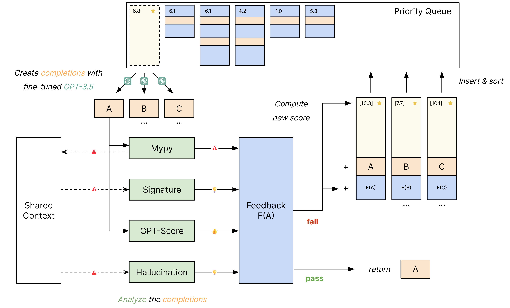

<div align="center">


</div>

<h1 align="center" style="margin-top: 0px;"><b>LLMcoder</b> - A Feedback-Based Coding Assistant</h1>
<h2 align="center" style="margin-top: 0px;">Practical AI Methods and Tools for Programming</h2>

<div align="center">

[](https://github.com/pvs-hd-tea/23ws-LLMcoder/actions/workflows/pytest.yml)
[](https://github.com/pvs-hd-tea/23ws-LLMcoder/actions/workflows/pre-commit.yml)
</div>




# Introduction
Enhancemenent of coding assistants through integration of feedback from LLM querying. LLMCoder fetches and retrieves API information and documentation based on error report obtained from four different analyzers. These aim to prevent instances of type errors, incorrect API signature usage and LLM-induced hallucinations. These have been implemented after fine-tuning GPT-3.5 aligning with a evaluated scale of difficulty levels.
# Requirements
## Hardware
## Software
- Python >= 3.10
- `pip` >= [21.3](https://pip.pypa.io/en/stable/news/#v21-3)
# Getting Started
## Clone The Repository

```sh
git clone https://github.com/pvs-hd-tea/23ws-LLMcoder
cd 23ws-LLMcoder
```

## Create A Virtual Environment (optional):

### With conda

```sh
conda create -n llmcoder python=3.11 [ipykernel]
conda activate llmcoder
```

## Install

### Install the package

```sh
pip install -e .
```

## Usage

CLI:
```sh
llmcoder [command] [options]
```

Python API:
```python
from llmcoder import LLMcoder

llmcoder = LLMcoder(
    analyzers=[
        "mypy_analyzer_v1",  # Detect and fix type errors
        "signature_analyzer_v1",  # Augment type errors with signatures
        "gpt_score_analyzer_v1"],  # Score and find best completion
    feedback_variant="coworker",  # Make context available to all analyzers
    max_iter=3,  # Maximum number of feedback iterations
    n_procs=4  # Complete and analyze in parallel
    backtracking=True, # Enable backtracking in the tree of completions
    verbose=True  # Print progress
)

# Define an incomplete code snippet
code = "print("

# Complete the code
result = llmcoder.complete(code, n=4)
```

# Evaluation

## 1. Compile the dataset

To compile a dataset from input-output-pairs to a `conversations.jsonl` file, run

```sh
llmcoder export -n name/of/dataset
```

on a dataset stored in `/data/name/of/dataset`.

## 2. Install packages used in the evaluation

```sh
pip install -r data/name/of/dataset/requirements.txt
```

## 3. Run the LLMcoder Evaluation

To evaluate LLMcoder on all configs in `/configs`, run

```sh
llmcoder evaluate
```

To evaluate LLMcoder on a specific config, run

```sh
llmcoder evaluate -c my_config.yaml
```

where `my_config.yaml` is a configuration file from `/configs`.

The following files will be created for each config and run:

- `/data/name/of/dataset/eval/<config_name>/<run_id>/results.json` with
  - `messages`: the message history
  - `analyzer_results`: analyzer results for each step
  - `log`: a log of the run
  - `time`: the time it took to complete the run
- `/data/name/of/dataset/eval/<config_name>/<run_id>/readable_logs/<example_id>.txt` with
  - a human-readable log of the run

for each example in the dataset

## 4. Compute metrics
After running the evaluation, compute the metrics for all configs in `/configs` with

```sh
llmcoder metrics
```

To compute the metrics for a specific config, run

```sh
llmcoder metrics -c my_config.yaml
```

where `my_config.yaml` is a configuration file from `/configs`.#

This will create the following files for each config and run:

- `/data/name/of/dataset/eval/<config_name>/<run_id>/metrics.csv`

# Development

## Setup
To set up the development environment, run the following commands:

```sh
pip install -e .[dev]
pre-commit install
```

For further information, see [CONTRIBUTING.md](./docs/CONTRIBUTING.md).


# Citation
```bibtex
@software{llmcoder-hd-24,
    author = {Ana Carsi and Kushal Gaywala and Paul Saegert},
    title = {LLMcoder: Feedback-Based Code Assistant},
    month = mar,
    year = 2024,
    publisher = {GitHub},
    version = {0.4.0},
    url = {https://github.com/pvs-hd-tea/23ws-LLMcoder}
}
```
